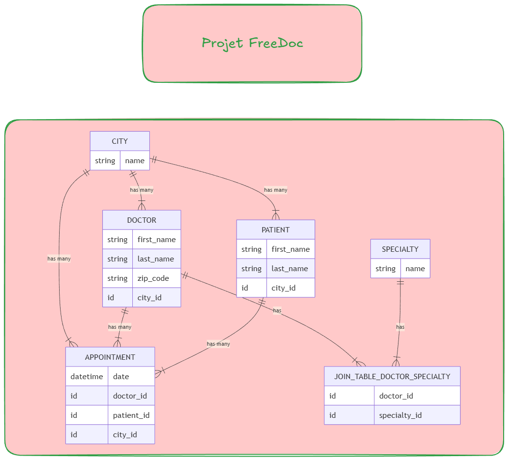

# 🏥 FreeDoc - The Medical Booking System (Rails Edition)

Welcome to **FreeDoc**, a database-centric project created as part of **The Hacking Project (THP)** bootcamp.  
The goal of this project is to master **ActiveRecord** and complex database relationships (1-1, 1-N, and N-N) by building a functional backend clone of a medical appointment platform like Doctolib.

## 🛠️ Prerequisites

* **Ruby** (version 3.0 or higher)
* **Rails** (version 7.x or higher)
* **Gems**: `faker` (for generating seed data)

## 📂 Database Architecture

This project implements a robust relational schema to manage doctors, patients, and their interactions across various cities.

Le schéma ERD du projet est fourni dans **`FreeDoc.png`** (diagramme entité-association).



### Entités et attributs (ERD)
| Table | Attributs |
|------|-----------|
| **CITY** | `name` (string) |
| **DOCTOR** | `first_name`, `last_name`, `zip_code` (string), `city_id` (FK) |
| **PATIENT** | `first_name`, `last_name` (string), `city_id` (FK) |
| **SPECIALTY** | `name` (string) |
| **APPOINTMENT** | `date` (datetime), `doctor_id`, `patient_id`, `city_id` (FK) |
| **JOIN_TABLE_DOCTOR_SPECIALTY** | `doctor_id`, `specialty_id` (FK) |

Rails ajoute automatiquement `id` (PK) et `created_at` / `updated_at` sur chaque table. Les clés marquées « H » sur le schéma (ex. `name` pour CITY/SPECIALTY) correspondent en pratique à des contraintes d’unicité ou d’index ; la clé primaire reste `id`.

### Relations (ERD)
- **CITY** → 1-N → DOCTOR, PATIENT, APPOINTMENT  
- **DOCTOR** ↔ N-N ↔ SPECIALTY via JOIN_TABLE_DOCTOR_SPECIALTY  
- **DOCTOR** → 1-N → APPOINTMENT ; **PATIENT** → 1-N → APPOINTMENT (N-N Doctor–Patient via Appointment)

**Note** : Sur le schéma, un trait « has » relie JOIN_TABLE_DOCTOR_SPECIALTY à PATIENT. Cette relation n’est pas implémentée en base (aucun lien métier prévu dans le sujet FreeDoc) ; l’implémentation actuelle est alignée avec le sujet THP.

### Model Relationships (code):
* **Cities:** A central hub. `Doctors`, `Patients`, and `Appointments` all belong to a `City`.
* **Doctors & Patients:** Linked via a **Many-to-Many** relationship through `Appointments`.
* **Specialties:** A **Many-to-Many** relationship between `Doctors` and `Specialties` using a join table (`JoinTableDoctorSpecialty`).


## 🚀 Installation

1. **Clone the repository**:
    ```bash
    git clone <your-github-link>
    cd freedoc
    ```

2. **Install dependencies**:
    ```bash
    bundle install
    ```

3. **Setup the database**:
    ```bash
    rails db:create
    rails db:migrate
    ```

4. **Seed the database**:
    ```bash
    rails db:seed
    ```
    *This will populate your database with 10 cities, 7 specialties, 20 doctors, 50 patients, and 100 appointments using the Faker gem.*

---

## 🔍 Usage & Testing

Since this is a backend-only project, all verifications are performed via the **Rails Console**.

To enter the console, run:
```bash
rails console
```


### Useful Commands to Test Associations:

- Check a Doctor's Specialties (N-N):

```Ruby
Doctor.first.specialties
```

- Check a Doctor's Patients (N-N through):

```Ruby
Doctor.first.patients
```

- Verify City relationships (1-N):

```Ruby
City.first.doctors
City.first.patients
```

- Find the Doctor for a specific Appointment:

```Ruby
Appointment.last.doctor
```

## 💡 Key Concepts Learned

### 1. Advanced ActiveRecord Associations
- **has_many :through**: Used to link Doctors and Patients via Appointments. This allows for direct queries like doctor.patients instead of manually searching through appointments.

- **Join Tables**: Implemented for the Specialty model to allow doctors to have multiple medical expertises (e.g., a doctor being both a "Generalist" and a "Cardiologist").

### 2. Database Migrations
- Mastering the generation and modification of tables.

- Adding references (t.references or add_reference) to existing tables to create foreign key constraints.

### 3. Data Integrity & Seeding
- Writing a robust seeds.rb script that respects the order of creation (creating Cities before Doctors) and uses .sample to create realistic, randomized data links.

## 🛠️ Project Evolution (Boost Features)
Initially started with basic Doctor/Patient attributes, the project was scaled to include:

- **Multi-City Support**: Every entity is now geographically located.

- **Specialty Refactoring**: Transitioned from a simple string attribute to a dedicated Specialty model to handle complex medical profiles.

## 👨‍💻 Authors
This project is for educational use within The Hacking Project. Feel free to modify or improve it in your own fork.

*Morgan, Romain & Valentin*

*The Hacking Project 2026*